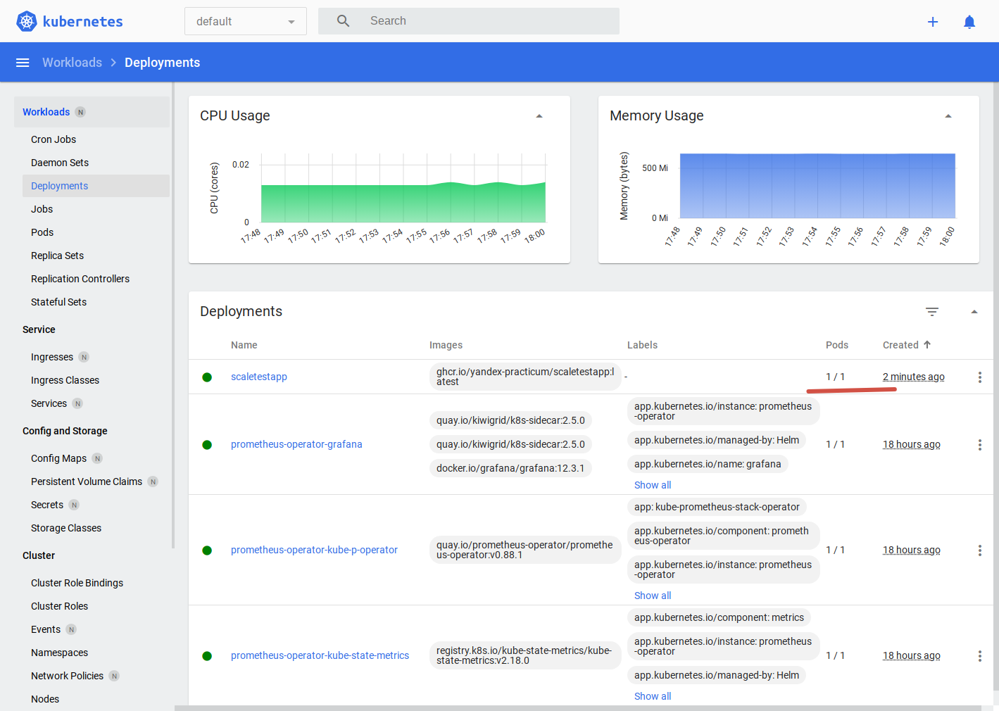
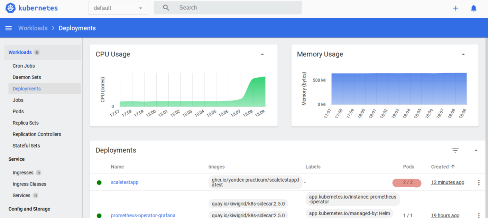
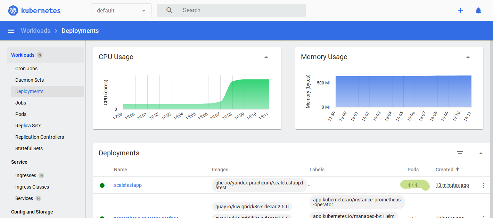

# Часть 1. Динамическая маршрутизация на основании показателей утилизации памяти

## Тестовое приложение:
- docker-image: `ghcr.io/yandex-practicum/scaletestapp:sha256-eff20ae3ae2d596375f9ed6d612a78d149a35a66cd2907ea90d7175ca918c993.sig`
- порт: `8080`
- ручки:
    - GET / — возвращает идентификатор pod
    - GET /metrics — Prometheus-метрики, внутри есть `http_requests_total`

## Описание файлов в директории Task2/app
- locustfile.py - задание для locust
- k8s/deployment.yaml - Deployment приложения (1 реплика, memory limit 30Mi)
- k8s/service.yaml - Service для доступа к приложению
- k8s/hpa-memory.yaml - HPA по памяти (по заданию: target 80%, maxReplicas 10)


## Запуск
1. На запущеном minikube
   - запуск тестового приложения через манифесты
    ```bash
    cd Task2/app
    kubectl apply -f k8s/deployment.yaml
    kubectl apply -f k8s/service.yaml
    kubectl apply -f k8s/hpa-memory.yaml
    
    ```

1. Пробросить порт к приложению:
    ```bash
    minikube service scaletestapp --url 
    ```
    ответ:
    ```bash
    (.venv) [slava@altlinux-vm-1 app]$ minikube service scaletestapp --url 
    http://192.168.49.2:31432
    ```

1. Запустить locust:
    ```bash
    # Установка locust
    python -m venv .venv
    source ./.venv/bin/activate
    pip install locust
    
    #Запуск
    locust -f ./Task2/locust.py
    ```

1. Указать проброшенный урл http://192.168.49.2:31432 как host. Запустить locust-тест.

1. Открыть дашборд
    ```bash
    minikube dashboard 
    ```
Изначально была 1 реплика в деплойменте:


## Результаты
С ростом нагрузки количество реплик стало увеличиваться.



Лог HPA также показывает прирост реплик:
```bash
 kubectl get hpa -w
```
[hpa-memory.log](hpa-memory.log)

## Вывод

**HPA Memory работает!**

## Очистка K8S
Удалить приложение
```bash
(.venv) [slava@altlinux-vm-1 app]$ kubectl delete -f ./k8s/hpa-memory.yaml
horizontalpodautoscaler.autoscaling "scaletestapp-hpa-memory" deleted
(.venv) [slava@altlinux-vm-1 app]$ kubectl delete -f ./k8s/service.yaml
service "scaletestapp" deleted
(.venv) [slava@altlinux-vm-1 app]$ kubectl delete -f ./k8s/deployment.yaml
deployment.apps "scaletestapp" deleted
```